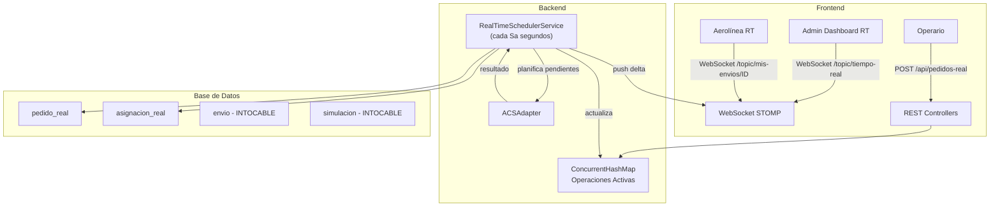

# Plan de Implementación: Sistema de Operaciones en Tiempo Real

## Contexto y Problema

El sistema SUITChASE actualmente opera con dos modos compartiendo las mismas tablas:
- **Simulación**: Usa `SimulacionEntity` + `BloqueResultadoEntity` + `EnvioEntity` (con `simulacionId != null`) + `AsignacionEnvioEntity` (con `bloqueResultadoId != null`)
- **Tiempo real**: Usa `EnvioEntity` con `simulacionId = null` + `AsignacionEnvioEntity` con `bloqueResultadoId = null`

### Problemas identificados

1. **Contaminación de datos**: La tabla `envio` mezcla envíos de simulación y de tiempo real. Consultas frecuentes del admin requieren filtrar por `simulacion_id IS NULL` constantemente.
2. **Rendimiento en consultas**: La vista del administrador será **muy consultada** — volcar todos los envíos en una tabla simple no es eficiente. Se necesita una estrategia de datos pre-agregados y push reactivo.
3. **El `AirlineTracking` actual** usa datos del motor de simulación in-memory (`useSim()` / `BaggageGroup`), no del backend real.
4. **El `RealTimeSchedulerService`** ya implementa la lógica base de planificación en tiempo real, pero solo notifica un resumen simple vía WebSocket.

---

## Análisis de Eficiencia: ¿Por qué no solo una tabla?

> [!IMPORTANT]
> La vista de tiempo real del administrador será muy consultada. Analicemos las alternativas:

### Opción A: Query directa a `envio` con filtros ❌
```sql
SELECT * FROM envio WHERE simulacion_id IS NULL AND estado IN ('PENDIENTE','EN_RUTA') ORDER BY fecha_hora_registro DESC;
```
**Problemas**: Con miles de envíos históricos + simulaciones, este query se degrada. Cada consulta HTTP es un full scan (aunque indexado, la tabla crecerá indefinidamente). Cada cliente que refresca la página genera un query.

### Opción B: Tabla separada para tiempo real + Vista materializada + WebSocket push ✅
- **Tabla dedicada `pedido_real`**: Solo contiene datos de operaciones reales (no simulación). Tabla más pequeña, queries más rápidos.
- **Vista materializada `v_operaciones_activas`** (o query view en MySQL): Resumen pre-calculado de lo que se muestra al admin.
- **WebSocket push**: El admin se suscribe y recibe actualizaciones sin hacer polling. Solo se envían deltas (cambios), no la tabla completa.
- **Caché en memoria (Spring `@Cacheable` / HashMap concurrente)**: Mantener un snapshot de operaciones activas en RAM para servir consultas instantáneamente.

### Opción C: Redis como caché de lectura rápida (opcional, futuro) 🔮
Si el volumen crece mucho, se puede agregar Redis como capa de caché delante de la DB. Por ahora el caché en memoria de Spring es suficiente.

**Decisión: Opción B** — Tabla separada + caché en memoria + WebSocket push.

---

## User Review Required

> [!IMPORTANT]
> **Separación de tablas vs. filtro por columna**: El plan propone crear una nueva tabla `pedido_real` separada de `envio` para evitar contaminación. Otra opción es seguir usando `envio` pero con mejores índices y caché. ¿Prefieres la separación o mantener una sola tabla?

> [!WARNING]
> **Aerolínea vinculada a vuelos**: En el modelo actual, `VueloEntity` no tiene un campo `aerolinea_id`. Esto significa que no sabemos qué aerolínea opera cada vuelo. Para la vista de la aerolínea en tiempo real, se filtran los **pedidos** por aerolínea, no los vuelos. ¿Quieres agregar `aerolinea_id` a `VueloEntity` en el futuro, o es suficiente filtrar por los pedidos de la aerolínea?

> [!IMPORTANT]
> **Frecuencia del scheduler Sa**: Actualmente `planificador.sa-ms=120000` (cada 2 min). ¿Cada cuánto quieres que se planifiquen los pedidos pendientes en tiempo real? ¿Mantener 2 min o cambiarlo?

---

## Open Questions

1. **¿Qué información exacta quieres ver en la vista del admin en tiempo real?** El plan propone:
   - KPIs globales (total pedidos activos, en ruta, entregados hoy, SLA promedio)
   - Mapa con pedidos activos en vuelo (animados)
   - Tabla paginada con filtros (aerolínea, estado, origen/destino)
   - ¿Algo más?

2. **¿La aerolínea debe ver el mapa con sus pedidos o solo una lista/tabla?** El plan propone mapa + lista.

3. **Historico de pedidos para aerolíneas**: Dices "luego ya veremos". ¿Deseas que el modelo de datos ya soporte esto (campo `fechaEntrega`, etc.) aunque no lo implementemos en el frontend ahora?

---

## Arquitectura Propuesta



---

## Proposed Changes

### Componente 1: Modelo de Datos (Backend — Domain)

> Todas las tablas existentes (`envio`, `simulacion`, `bloque_resultado`, `asignacion_envio`) quedan **intactas**. No se modifican.

---

#### [NEW] [PedidoRealEntity.java](file:///c:/Users/cesar/OneDrive/Escritorio/PUCP/9no/DP1/SUITCHaSE-smithchad/SUITChASE/Backend/src/main/java/com/tasf/b2b/domain/PedidoRealEntity.java)

Nueva entidad dedicada exclusivamente a pedidos de operaciones en tiempo real.

```java
@Entity
@Table(name = "pedido_real", indexes = {
    @Index(name = "idx_pr_aerolinea_estado", columnList = "aerolinea_id, estado"),
    @Index(name = "idx_pr_estado_fecha", columnList = "estado, fecha_hora_registro"),
    @Index(name = "idx_pr_operario", columnList = "operario_id")
})
public class PedidoRealEntity {
    @Id
    @Column(length = 50)
    private String id;                    // "PED-XXXXXXXX"

    private String origenOaci;            // OACI 4 chars
    private String destinoOaci;
    private LocalDateTime fechaHoraRegistro;
    private Integer cantidadMaletas;
    private Long aerolineaId;
    private Long operarioId;              // Quién lo registró

    @Enumerated(EnumType.STRING)
    private EstadoPedido estado = EstadoPedido.PENDIENTE;

    private LocalDateTime fechaPlanificacion;  // Cuándo fue planificado
    private LocalDateTime fechaEntrega;        // Cuándo se entregó (null si no)
    private Integer totalTramos;               // Número de vuelos asignados

    private LocalDateTime createdAt;
    private LocalDateTime updatedAt;

    public enum EstadoPedido {
        PENDIENTE,      // Registrado, esperando planificación
        PLANIFICADO,    // Ruta asignada, aún no despegó
        EN_RUTA,        // Al menos un tramo en vuelo
        ENTREGADO,      // Llegó al destino
        SIN_RUTA,       // No se encontró ruta viable
        COLAPSO         // Excedió SLA
    }
}
```

**Diferencias con `EnvioEntity`**:
- Sin `simulacionId` (no hay mezcla)
- Sin `esSintetico` (siempre es real)
- Campos adicionales: `fechaPlanificacion`, `fechaEntrega`, `totalTramos`
- Estados más granulares: `PLANIFICADO` (intermedio entre PENDIENTE y EN_RUTA)

---

#### [NEW] [AsignacionRealEntity.java](file:///c:/Users/cesar/OneDrive/Escritorio/PUCP/9no/DP1/SUITCHaSE-smithchad/SUITChASE/Backend/src/main/java/com/tasf/b2b/domain/AsignacionRealEntity.java)

Tramos de vuelo para pedidos reales (equivalente a `AsignacionEnvioEntity` pero sin `bloqueResultadoId`).

```java
@Entity
@Table(name = "asignacion_real", indexes = {
    @Index(name = "idx_ar_pedido", columnList = "pedido_id"),
    @Index(name = "idx_ar_estado_fecha", columnList = "estado, fecha_salida")
})
public class AsignacionRealEntity {
    @Id @GeneratedValue(strategy = GenerationType.IDENTITY)
    private Long id;

    @Column(name = "pedido_id", nullable = false, length = 50)
    private String pedidoId;

    private Integer ordenVuelo;          // 1, 2, 3...
    private Long vueloId;
    private String origenOaci;           // Denormalizado para consultas rápidas
    private String destinoOaci;          // Denormalizado
    private LocalDateTime fechaSalida;
    private LocalDateTime fechaLlegada;

    @Enumerated(EnumType.STRING)
    private EstadoTramo estado = EstadoTramo.PROGRAMADO;

    public enum EstadoTramo {
        PROGRAMADO,     // Aún no despegó
        EN_VUELO,       // Actualmente volando
        COMPLETADO,     // Aterrizó
        CANCELADO
    }
}
```

**Ventajas**:
- Campos `origenOaci`/`destinoOaci` denormalizados evitan JOINs en consultas frecuentes.
- `EstadoTramo` permite tracking granular (el admin ve si un pedido está PROGRAMADO, EN_VUELO o COMPLETADO en cada tramo).

---

### Componente 2: Repositorios (Backend — Repository)

---

#### [NEW] [PedidoRealRepository.java](file:///c:/Users/cesar/OneDrive/Escritorio/PUCP/9no/DP1/SUITCHaSE-smithchad/SUITChASE/Backend/src/main/java/com/tasf/b2b/repository/PedidoRealRepository.java)

```java
public interface PedidoRealRepository extends JpaRepository<PedidoRealEntity, String> {
    // Para el scheduler: pedidos pendientes a planificar
    List<PedidoRealEntity> findByEstadoAndFechaHoraRegistroBeforeOrderByFechaHoraRegistroAsc(
            EstadoPedido estado, LocalDateTime antes);

    // Para la vista de aerolínea: solo sus pedidos activos
    List<PedidoRealEntity> findByAerolineaIdAndEstadoInOrderByFechaHoraRegistroDesc(
            Long aerolineaId, List<EstadoPedido> estados);

    // Para la vista de aerolínea: todos sus pedidos
    List<PedidoRealEntity> findByAerolineaIdOrderByFechaHoraRegistroDesc(Long aerolineaId);

    // Conteos para KPIs del admin
    long countByEstado(EstadoPedido estado);
    long countByEstadoIn(List<EstadoPedido> estados);

    // Para resumen por aerolínea
    @Query("SELECT p.aerolineaId, p.estado, COUNT(p) FROM PedidoRealEntity p " +
           "WHERE p.estado IN :estados GROUP BY p.aerolineaId, p.estado")
    List<Object[]> countByAerolineaAndEstadoIn(@Param("estados") List<EstadoPedido> estados);
}
```

---

#### [NEW] [AsignacionRealRepository.java](file:///c:/Users/cesar/OneDrive/Escritorio/PUCP/9no/DP1/SUITCHaSE-smithchad/SUITChASE/Backend/src/main/java/com/tasf/b2b/repository/AsignacionRealRepository.java)

```java
public interface AsignacionRealRepository extends JpaRepository<AsignacionRealEntity, Long> {
    List<AsignacionRealEntity> findByPedidoIdOrderByOrdenVueloAsc(String pedidoId);

    // Para la vista del admin: tramos actualmente en vuelo
    List<AsignacionRealEntity> findByEstadoOrderByFechaSalidaAsc(EstadoTramo estado);

    // Para actualizar tramos por hora
    @Query("SELECT a FROM AsignacionRealEntity a WHERE a.estado = 'PROGRAMADO' AND a.fechaSalida <= :ahora")
    List<AsignacionRealEntity> findTramosQueDeberianEstarEnVuelo(@Param("ahora") LocalDateTime ahora);

    @Query("SELECT a FROM AsignacionRealEntity a WHERE a.estado = 'EN_VUELO' AND a.fechaLlegada <= :ahora")
    List<AsignacionRealEntity> findTramosQueDeberianHaberAterrizado(@Param("ahora") LocalDateTime ahora);
}
```

---

### Componente 3: Servicio de Operaciones en Tiempo Real (Backend — Service)

---

#### [NEW] [RealTimeOperationsService.java](file:///c:/Users/cesar/OneDrive/Escritorio/PUCP/9no/DP1/SUITCHaSE-smithchad/SUITChASE/Backend/src/main/java/com/tasf/b2b/service/RealTimeOperationsService.java)

Servicio central de operaciones en tiempo real. Mantiene un **caché en memoria** de las operaciones activas para servir consultas del admin sin golpear la DB.

```java
@Service
@RequiredArgsConstructor
@Slf4j
public class RealTimeOperationsService {

    private final PedidoRealRepository pedidoRepo;
    private final AsignacionRealRepository asignacionRepo;
    private final SimpMessagingTemplate messagingTemplate;

    // ====== CACHÉ EN MEMORIA ======
    // Snapshot de operaciones activas (se recarga al iniciar, se actualiza incrementalmente)
    private final ConcurrentHashMap<String, PedidoRealDTO> operacionesActivas = new ConcurrentHashMap<>();
    private final AtomicReference<ResumenOperacionesDTO> resumenCache = new AtomicReference<>();

    @PostConstruct
    public void cargarCacheInicial() {
        // Cargar todos los pedidos activos (PENDIENTE, PLANIFICADO, EN_RUTA) en memoria
        var activos = pedidoRepo.findByEstadoIn(List.of(PENDIENTE, PLANIFICADO, EN_RUTA));
        activos.forEach(p -> operacionesActivas.put(p.getId(), toDTO(p)));
        recalcularResumen();
        log.info("[TiempoReal] Caché inicializado con {} operaciones activas", activos.size());
    }

    // Registrar pedido (llamado desde controller del operario)
    public PedidoRealDTO registrarPedido(RegistroPedidoRequest req, Long operarioId) {
        PedidoRealEntity pedido = new PedidoRealEntity();
        pedido.setId("PED-" + UUID.randomUUID().toString().substring(0, 8).toUpperCase());
        // ... setear campos ...
        pedidoRepo.save(pedido);

        // Agregar al caché
        PedidoRealDTO dto = toDTO(pedido);
        operacionesActivas.put(pedido.getId(), dto);
        recalcularResumen();

        // Push al admin
        messagingTemplate.convertAndSend("/topic/tiempo-real/nuevo-pedido", dto);
        return dto;
    }

    // Consulta del admin: devuelve desde caché (NO desde DB)
    public ResumenOperacionesDTO getResumenOperaciones() {
        return resumenCache.get();
    }

    // Consulta del admin: lista de operaciones activas (desde caché)
    public Collection<PedidoRealDTO> getOperacionesActivas(String filtroEstado,
                                                            Long filtroAerolinea,
                                                            String filtroOrigen) {
        return operacionesActivas.values().stream()
                .filter(p -> filtroEstado == null || p.estado().equals(filtroEstado))
                .filter(p -> filtroAerolinea == null || p.aerolineaId().equals(filtroAerolinea))
                .filter(p -> filtroOrigen == null || p.origenOaci().contains(filtroOrigen))
                .sorted(Comparator.comparing(PedidoRealDTO::fechaHoraRegistro).reversed())
                .toList();
    }

    // Consulta de aerolínea: pedidos activos propios
    public List<PedidoRealDTO> getPedidosActivosAerolinea(Long aerolineaId) {
        return operacionesActivas.values().stream()
                .filter(p -> p.aerolineaId().equals(aerolineaId))
                .sorted(Comparator.comparing(PedidoRealDTO::fechaHoraRegistro).reversed())
                .toList();
    }

    // Llamado por el scheduler tras planificar
    public void actualizarPedidosPlanificados(List<PedidoRealEntity> planificados) {
        for (var p : planificados) {
            PedidoRealDTO dto = toDTO(p);
            if (p.getEstado() == EstadoPedido.ENTREGADO || p.getEstado() == EstadoPedido.COLAPSO) {
                operacionesActivas.remove(p.getId());
            } else {
                operacionesActivas.put(p.getId(), dto);
            }
        }
        recalcularResumen();

        // Push cambios al admin
        messagingTemplate.convertAndSend("/topic/tiempo-real/actualizacion", resumenCache.get());

        // Push a cada aerolínea afectada
        planificados.stream()
                .map(PedidoRealEntity::getAerolineaId)
                .distinct()
                .forEach(aId -> {
                    var pedidosAerolinea = getPedidosActivosAerolinea(aId);
                    messagingTemplate.convertAndSend("/topic/mis-pedidos/" + aId, pedidosAerolinea);
                });
    }

    private void recalcularResumen() {
        long pendientes = operacionesActivas.values().stream()
                .filter(p -> "PENDIENTE".equals(p.estado())).count();
        long planificados = operacionesActivas.values().stream()
                .filter(p -> "PLANIFICADO".equals(p.estado())).count();
        long enRuta = operacionesActivas.values().stream()
                .filter(p -> "EN_RUTA".equals(p.estado())).count();
        resumenCache.set(new ResumenOperacionesDTO(
                operacionesActivas.size(), pendientes, planificados, enRuta,
                LocalDateTime.now()
        ));
    }
}
```

**¿Por qué caché en memoria?**
- El admin consulta esta vista constantemente. Si cada consulta fuera un `SELECT` a la DB, generaríamos cientos de queries por minuto.
- El `ConcurrentHashMap` se actualiza **solo cuando hay cambios** (registro nuevo o resultado del planificador).
- Las consultas del admin se resuelven en **O(n) sobre datos en memoria**, no sobre I/O de disco.
- En un futuro, si el sistema escala a múltiples instancias, se puede migrar a Redis.

---

#### [MODIFY] [RealTimeSchedulerService.java](file:///c:/Users/cesar/OneDrive/Escritorio/PUCP/9no/DP1/SUITCHaSE-smithchad/SUITChASE/Backend/src/main/java/com/tasf/b2b/service/RealTimeSchedulerService.java)

Refactorizar para usar `PedidoRealEntity` en vez de `EnvioEntity`. La lógica de planificación se mantiene idéntica (ACSAdapter), pero ahora lee de `pedido_real` y escribe en `asignacion_real`.

```diff
 // 1. Obtener pedidos pendientes de tiempo real
-List<EnvioEntity> enviosPendientes = envioRepository
-        .findBySimulacionIdIsNullAndEstadoAndFechaHoraRegistroBeforeOrderByFechaHoraRegistroAsc(
-                EstadoEnvio.PENDIENTE, ahora);
+List<PedidoRealEntity> pedidosPendientes = pedidoRealRepository
+        .findByEstadoAndFechaHoraRegistroBeforeOrderByFechaHoraRegistroAsc(
+                EstadoPedido.PENDIENTE, ahora);

 // ... misma lógica ACS ...

 // 4. Persistir asignaciones
-asignacionEnvioRepository.save(asig);
+asignacionRealRepository.save(asigReal);

 // 5. Notificar
-messagingTemplate.convertAndSend("/topic/tiempo-real", ...);
+realTimeOperationsService.actualizarPedidosPlanificados(pedidosPlanificados);
```

---

#### [NEW] [TramoStatusUpdaterService.java](file:///c:/Users/cesar/OneDrive/Escritorio/PUCP/9no/DP1/SUITCHaSE-smithchad/SUITChASE/Backend/src/main/java/com/tasf/b2b/service/TramoStatusUpdaterService.java)

Servicio que se ejecuta periódicamente (cada 1 min) para actualizar los estados de los tramos basándose en la hora real:

```java
@Scheduled(fixedDelay = 60000)  // Cada minuto
public void actualizarEstadosTramos() {
    LocalDateTime ahora = LocalDateTime.now();

    // Tramos que deberían haber despegado → EN_VUELO
    var despegados = asignacionRealRepo.findTramosQueDeberianEstarEnVuelo(ahora);
    despegados.forEach(t -> t.setEstado(EstadoTramo.EN_VUELO));
    asignacionRealRepo.saveAll(despegados);

    // Tramos que deberían haber aterrizado → COMPLETADO
    var aterrizados = asignacionRealRepo.findTramosQueDeberianHaberAterrizado(ahora);
    aterrizados.forEach(t -> {
        t.setEstado(EstadoTramo.COMPLETADO);
        // Si es el último tramo del pedido → marcar pedido como ENTREGADO
        actualizarEstadoPedidoSiCorresponde(t.getPedidoId());
    });
    asignacionRealRepo.saveAll(aterrizados);

    // Actualizar caché y notificar si hubo cambios
    if (!despegados.isEmpty() || !aterrizados.isEmpty()) {
        realTimeOperationsService.refrescarCache();
    }
}
```

---

### Componente 4: DTOs (Backend)

---

#### [NEW] [PedidoRealDTO.java](file:///c:/Users/cesar/OneDrive/Escritorio/PUCP/9no/DP1/SUITCHaSE-smithchad/SUITChASE/Backend/src/main/java/com/tasf/b2b/api/dto/PedidoRealDTO.java)

```java
public record PedidoRealDTO(
    String id,
    String origenOaci,
    String destinoOaci,
    LocalDateTime fechaHoraRegistro,
    Integer cantidadMaletas,
    Long aerolineaId,
    String nombreAerolinea,
    String estado,
    Integer totalTramos,
    Integer tramoActual,       // Cuál tramo está en vuelo
    String ubicacionActual,    // OACI del aeropuerto actual o "EN_VUELO XXXX→YYYY"
    List<TramoDTO> tramos
) {}

public record TramoDTO(
    Integer orden,
    String origenOaci,
    String destinoOaci,
    LocalDateTime fechaSalida,
    LocalDateTime fechaLlegada,
    String estado
) {}

public record ResumenOperacionesDTO(
    long totalActivos,
    long pendientes,
    long planificados,
    long enRuta,
    LocalDateTime ultimaActualizacion
) {}
```

---

### Componente 5: Controllers (Backend — API)

---

#### [NEW] [RealTimeController.java](file:///c:/Users/cesar/OneDrive/Escritorio/PUCP/9no/DP1/SUITCHaSE-smithchad/SUITChASE/Backend/src/main/java/com/tasf/b2b/api/RealTimeController.java)

Endpoints dedicados a operaciones en tiempo real:

```java
@RestController
@RequestMapping("/api/tiempo-real")
@RequiredArgsConstructor
public class RealTimeController {

    private final RealTimeOperationsService rtService;

    // ======== ADMIN ========

    // GET /api/tiempo-real/resumen — KPIs globales (desde caché)
    @GetMapping("/resumen")
    public ResponseEntity<ResumenOperacionesDTO> resumen() {
        return ResponseEntity.ok(rtService.getResumenOperaciones());
    }

    // GET /api/tiempo-real/operaciones — Lista de operaciones activas (desde caché)
    @GetMapping("/operaciones")
    public ResponseEntity<Collection<PedidoRealDTO>> operaciones(
            @RequestParam(required = false) String estado,
            @RequestParam(required = false) Long aerolineaId,
            @RequestParam(required = false) String origen) {
        return ResponseEntity.ok(rtService.getOperacionesActivas(estado, aerolineaId, origen));
    }

    // GET /api/tiempo-real/pedido/{id} — Detalle de un pedido con tramos
    @GetMapping("/pedido/{id}")
    public ResponseEntity<PedidoRealDTO> detallePedido(@PathVariable String id) {
        return ResponseEntity.ok(rtService.getDetallePedido(id));
    }

    // ======== AEROLÍNEA ========

    // GET /api/tiempo-real/mis-pedidos — Pedidos activos de la aerolínea logueada
    @GetMapping("/mis-pedidos")
    public ResponseEntity<List<PedidoRealDTO>> misPedidos(Authentication auth) {
        Long aerolineaId = (Long) auth.getCredentials();
        return ResponseEntity.ok(rtService.getPedidosActivosAerolinea(aerolineaId));
    }

    // ======== OPERARIO ========

    // POST /api/tiempo-real/pedidos — Registrar nuevo pedido
    @PostMapping("/pedidos")
    public ResponseEntity<PedidoRealDTO> registrarPedido(
            @RequestBody RegistroPedidoRequest request,
            Authentication auth) {
        Long operarioId = /* extraer del token */;
        return ResponseEntity.status(HttpStatus.CREATED)
                .body(rtService.registrarPedido(request, operarioId));
    }
}
```

> [!NOTE]
> El `EnvioController` existente **no se modifica**. Los endpoints antiguos (`/api/envios/*`) siguen funcionando para mantener compatibilidad con la simulación.

---

### Componente 6: WebSocket — Topics nuevos

---

#### [MODIFY] [WebSocketConfig.java](file:///c:/Users/cesar/OneDrive/Escritorio/PUCP/9no/DP1/SUITCHaSE-smithchad/SUITChASE/Backend/src/main/java/com/tasf/b2b/config/WebSocketConfig.java)

No requiere cambios. El broker simple (`/topic`) ya soporta los nuevos topics:
- `/topic/tiempo-real/actualizacion` — Push de resumen al admin
- `/topic/tiempo-real/nuevo-pedido` — Push cuando se registra un pedido nuevo
- `/topic/mis-pedidos/{aerolineaId}` — Push a aerolínea específica

---

### Componente 7: Frontend — Admin (Vista Tiempo Real)

---

#### [NEW] [RealTimeDashboard.tsx](file:///c:/Users/cesar/OneDrive/Escritorio/PUCP/9no/DP1/SUITCHaSE-smithchad/SUITChASE/Frontend/src/app/components/RealTimeDashboard.tsx)

Nueva página para el administrador cuando seleccione "Tiempo Real":

**Estructura de la vista**:
```
┌─────────────────────────────────────────────────┐
│  KPIs: Pendientes | Planificados | En Ruta | SLA │
├──────────────────────┬──────────────────────────┤
│                      │  Panel lateral:          │
│   Mapa con pedidos   │  - Filtros               │
│   en vuelo           │  - Lista de operaciones  │
│   (animaciones)      │  - Detalle al click      │
│                      │                          │
└──────────────────────┴──────────────────────────┘
```

- Se suscribe al WebSocket `/topic/tiempo-real/actualizacion`
- Carga inicial via `GET /api/tiempo-real/operaciones`
- Actualizaciones push (no polling)
- Filtros por estado, aerolínea, origen/destino
- Click en un pedido muestra ruta detallada con tramos y estado de cada uno

---

#### [NEW] [RealTimeWebSocketClient.ts](file:///c:/Users/cesar/OneDrive/Escritorio/PUCP/9no/DP1/SUITCHaSE-smithchad/SUITChASE/Frontend/src/app/services/realTimeWebSocket.ts)

Cliente WebSocket dedicado para tiempo real (separado del de simulación):

```typescript
export class RealTimeWebSocketClient {
    // Se suscribe a /topic/tiempo-real/* para admin
    // Se suscribe a /topic/mis-pedidos/{aerolineaId} para aerolínea
}
```

---

#### [MODIFY] [routes.tsx](file:///c:/Users/cesar/OneDrive/Escritorio/PUCP/9no/DP1/SUITCHaSE-smithchad/SUITChASE/Frontend/src/app/routes.tsx)

Agregar ruta para la vista de tiempo real del admin:

```diff
 { path: "simulacion", Component: SimulationPage },
+{ path: "tiempo-real", Component: RealTimeDashboard },
```

---

#### [MODIFY] [Layout.tsx](file:///c:/Users/cesar/OneDrive/Escritorio/PUCP/9no/DP1/SUITCHaSE-smithchad/SUITChASE/Frontend/src/app/components/Layout.tsx)

Agregar "Tiempo Real" al nav del admin:

```diff
 const NAV = [
   { to: "/", label: "Dashboard", icon: LayoutDashboard },
   { to: "/simulacion", label: "Simulador", icon: Activity },
+  { to: "/tiempo-real", label: "Tiempo Real", icon: Radio },
   { to: "/vuelos", label: "Vuelos", icon: Plane },
```

---

#### [MODIFY] [api.ts](file:///c:/Users/cesar/OneDrive/Escritorio/PUCP/9no/DP1/SUITCHaSE-smithchad/SUITChASE/Frontend/src/app/services/api.ts)

Agregar endpoints de tiempo real:

```diff
+  // Tiempo Real
+  getResumenRT: () => request<any>("/tiempo-real/resumen"),
+  getOperacionesRT: (params?) => request<any[]>("/tiempo-real/operaciones", { params }),
+  getMisPedidosRT: () => request<any[]>("/tiempo-real/mis-pedidos"),
+  registrarPedidoRT: (data) => request("/tiempo-real/pedidos", { method: "POST", body: data }),
+  getDetallePedidoRT: (id) => request<any>(`/tiempo-real/pedido/${id}`),
```

---

### Componente 8: Frontend — Aerolínea (Vista Tiempo Real)

---

#### [MODIFY] [AirlineTracking.tsx](file:///c:/Users/cesar/OneDrive/Escritorio/PUCP/9no/DP1/SUITCHaSE-smithchad/SUITChASE/Frontend/src/app/components/AirlineTracking.tsx)

Refactorizar para que cuando la aerolínea inicie sesión:
1. Haga `GET /api/tiempo-real/mis-pedidos` para carga inicial
2. Se suscriba a `/topic/mis-pedidos/{aerolineaId}` para updates en tiempo real
3. Muestre **solo pedidos activos** (no históricos por ahora)
4. Mantenga el mapa con los pedidos activos
5. Ya no dependa de `useSim()` (motor de simulación)

```diff
-import { useSim } from "../context/SimContext";
-const { state, airportsList } = useSim();
+// Carga datos del backend en tiempo real
+const [pedidos, setPedidos] = useState<PedidoRealDTO[]>([]);
+useEffect(() => {
+    api.getMisPedidosRT().then(setPedidos);
+    const ws = new RealTimeWebSocketClient(aerolineaId);
+    ws.onUpdate(setPedidos);
+    ws.connect();
+    return () => ws.disconnect();
+}, [aerolineaId]);
```

---

### Componente 9: Seguridad

---

#### [MODIFY] [SecurityConfig.java](file:///c:/Users/cesar/OneDrive/Escritorio/PUCP/9no/DP1/SUITCHaSE-smithchad/SUITChASE/Backend/src/main/java/com/tasf/b2b/config/SecurityConfig.java)

Agregar permisos para los nuevos endpoints:

```diff
+.requestMatchers("/api/tiempo-real/resumen", "/api/tiempo-real/operaciones").hasRole("ADMIN")
+.requestMatchers("/api/tiempo-real/mis-pedidos").hasRole("AEROLINEA")
+.requestMatchers(HttpMethod.POST, "/api/tiempo-real/pedidos").hasAnyRole("OPERARIO", "ADMIN")
+.requestMatchers("/api/tiempo-real/pedido/**").authenticated()
```

---

## Resumen de archivos

| Acción | Archivo | Descripción |
|--------|---------|-------------|
| **NEW** | `PedidoRealEntity.java` | Entidad para pedidos de tiempo real |
| **NEW** | `AsignacionRealEntity.java` | Tramos de vuelo para pedidos reales |
| **NEW** | `PedidoRealRepository.java` | Repositorio de pedidos reales |
| **NEW** | `AsignacionRealRepository.java` | Repositorio de asignaciones reales |
| **NEW** | `RealTimeOperationsService.java` | Servicio central con caché en memoria |
| **NEW** | `TramoStatusUpdaterService.java` | Actualiza estados de tramos por hora real |
| **NEW** | `RealTimeController.java` | Endpoints REST para tiempo real |
| **NEW** | `PedidoRealDTO.java` + DTOs | DTOs para la API |
| **NEW** | `RealTimeDashboard.tsx` | Vista admin tiempo real |
| **NEW** | `RealTimeWebSocketClient.ts` | Cliente WS para tiempo real |
| **MODIFY** | `RealTimeSchedulerService.java` | Usar nuevas tablas |
| **MODIFY** | `AirlineTracking.tsx` | Conectar al backend real |
| **MODIFY** | `routes.tsx` | Agregar ruta tiempo real |
| **MODIFY** | `Layout.tsx` | Agregar nav tiempo real |
| **MODIFY** | `api.ts` | Agregar endpoints RT |
| **MODIFY** | `SecurityConfig.java` | Permisos nuevos endpoints |
| ~~MODIFY~~ | `EnvioEntity.java` | **NO SE MODIFICA** |
| ~~MODIFY~~ | `SimulationService.java` | **NO SE MODIFICA** |

---

## Verification Plan

### Automated Tests
```bash
# 1. Verificar que la DB genera las nuevas tablas sin errores
mvn spring-boot:run  # (con ddl-auto=update)

# 2. Test de registro de pedido
curl -X POST http://localhost:8090/api/tiempo-real/pedidos \
  -H "Authorization: Bearer $TOKEN" \
  -H "Content-Type: application/json" \
  -d '{"origenOaci":"SPJC","destinoOaci":"KJFK","cantidadMaletas":5,"aerolineaId":1}'

# 3. Verificar que la simulación sigue funcionando
curl -X POST http://localhost:8090/api/simulacion/iniciar \
  -H "Authorization: Bearer $TOKEN" \
  -H "Content-Type: application/json" \
  -d '{"nombre":"Test","fechaInicio":"2027-07-24T00:00:00","fechaFin":"2027-07-25T00:00:00","sa":2,"k":4,"ta":10}'
```

### Manual Verification
- Verificar que la vista de simulación sigue funcionando sin cambios
- Verificar que la vista de tiempo real del admin muestra pedidos activos
- Verificar que la aerolínea ve solo sus pedidos al iniciar sesión
- Verificar que el WebSocket push funciona (registrar un pedido y ver que aparece en la vista del admin sin refrescar)
- Verificar que el scheduler planifica pedidos pendientes cada Sa segundos
